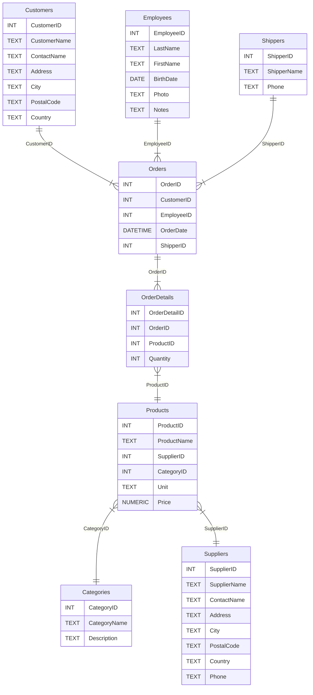

---
tags:
#   - HTML5
  # - JavaScript
  # - CSS
#   - YAML
#   - MkDocs
#   - Python
#   - Docker
#   - Podman
  # - MarkDown
#   - TypeScript
  # - CSV
#   - Bash
#   - Express
#   - ReactJS
#   - NodeJS
#   - NPM
#   - PNPM
#   - ViteJS
  - SQLite
#   - SQLAlchemy
  - MySQL
  - PostgreSQL
  - MariaDB
---

# Anexo - NorthWind 

Para mayor comodidad de uso se adjunta la base de datos Northwind adaptada para los gestores de base de datos más populares.

<!-- Links de descarga: -->

=== "SQLite"

    [Ver código online desde Wikiversity](https://en.wikiversity.org/wiki/Database_Examples/Northwind/SQLite)

    [Descargar script (.sql)](northwind_sqlite.sql){ .md-button .md-button--primary }

=== "MySQL / MariaDB"

    [Ver código online desde Wikiversity](https://en.wikiversity.org/wiki/Database_Examples/Northwind/MySQL)

    [Descargar script (.sql)](northwind_mysql.sql){ .md-button .md-button--primary }

=== "PostgreSQL"

    [Ver código online desde Wikiversity](https://en.wikiversity.org/wiki/Database_Examples/Northwind/PostgreSQL)

    [Descargar script (.sql)](northwind_postgresql.sql){ .md-button .md-button--primary }

=== "SQL Server"

    [Ver código online desde Wikiversity](https://en.wikiversity.org/wiki/Database_Examples/Northwind/SQL_Server)

    [Descargar script (.sql)](northwind_sqlserver.sql){ .md-button .md-button--primary }

Código extraído de [Wikiversity](https://en.wikiversity.org/wiki/Database_Examples/Northwind) con [licencia Creative Commons BY-SA 4.0](https://creativecommons.org/licenses/by-sa/4.0/)

**Diagrama Entidad-Estado (ER):**

