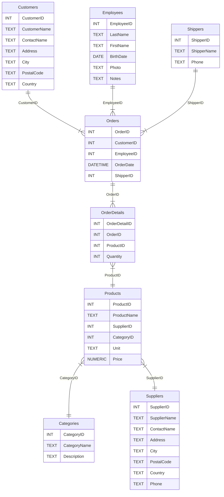

# Anexo - NorthWind 


Para mayor comodidad de uso se adjunta la base de datos Northwind adaptada para SQLite.
Código extraído de [Wikiversity](https://en.wikiversity.org/wiki/Database_Examples/Northwind/SQLite) con [licencia Creative Commons BY-SA 4.0](https://creativecommons.org/licenses/by-sa/4.0/)


[Descarga de archivo "northwind.sql" (para SQLite)](../anexos/northwind_sqlite.sql){ .md-button .md-button--primary }


??? abstract "Ver código de Northwind (SQLite)"

    ```sql title="Northwind para SQLite" linenums="1" 
    --8<- "docs/anexos/northwind_sqlite.sql"
    ```
    { data-search-exclude }


**Diagrama Entidad-Estado (ER):**




